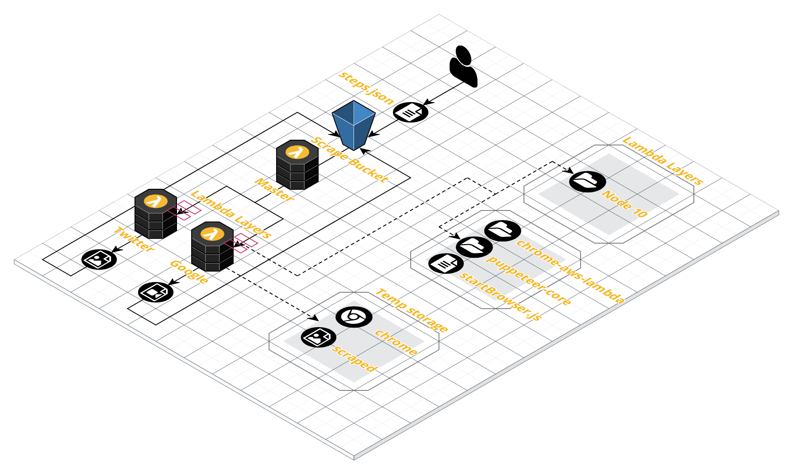

# SharpPuppets

## About this Challenge
This challenge revolves around the basics of browser automation. The tool we are focusing on is [Puppeteer](https://developers.google.com/web/tools/puppeteer), a browser automation tool akin to [Selenium](https://selenium.dev/). Browser automation tools are useful in Software Quality Assurance and web scraping tools for sites with little to no public API. 

The primary focus of this challenge revolves around building a functional browser automation tool, while keeping the infrastructure [serverless](https://aws.amazon.com/lambda/serverless-architectures-learn-more/) with the help of AWS Lambda functions. 

The browser automation infrastructure for this challenge will be built using Chrome, Puppeteer, Node, Dotnet Core, AWS Lambda, and AWS S3. 


## Challenge Infrastructure
### Infrastructure Diagram


**Chrome** and **Puppeteer** are managed by the [chrome-aws-lambda](https://www.npmjs.com/package/chrome-aws-lambda) NPM package. This package is updated with the latest version of Chrome and Puppeteer, but more importantly, manages to compress the executables down to a deployment package that is less than the [50 MB deployment package limit](https://docs.aws.amazon.com/lambda/latest/dg/limits.html) imposed by AWS Lambda. 

The **Chrome browser** is created by the chrome-aws-lambda package when the [C# Lambda function](./TwitterFunction/Function.cs#L38) calls the [JS Lambda Layer](./reference/chromeLayer/startBrowser.js). Once the browser is created, a [websocket address](./reference/chromeLayer/startBrowser.js#L11) is exposed for the [C# Lambda function to connect to](./TwitterFunction/Function.cs#L47). From there, **Chrome is controlled with the C# Lambda** using [Puppeteer-Sharp](https://github.com/kblok/puppeteer-sharp). 

> Lambda Layers can be thought of as [file folders that are available to your lambda function at runtime](./reference/images/LambdaLayer.png). In this challenge, we use two Lambda Layers. The first layer is a javascript file that calls the chrome-aws-lambda NPM package. The second layer is a linux executable of Node (C# lambda function does not have Node natively available). These Layers are compressed and uploaded to AWS. The compressed versions that get uploaded can be found in [assets](./assets). The [uncompressed versions of these folders](./reference) were added for reference and should not be altered for the purposes of this challenge. 

A [**Master Lambda Function**](./Master/Function.cs) exists to process the [initial input file](./steps.json) that contains directions of which sites to scrape, and how to scrape them. The Master Lambda will interpret the JSON file, and [invoke the appropriate Lambda function](./Master/Function.cs#L49).


# Level 1: Setup
## Dependencies
* Create [AWS Account](https://aws.amazon.com/)
* Install [AWS CLI](https://aws.amazon.com/cli/)
* Install [Dotnet 2.1](https://dotnet.microsoft.com/download/dotnet-core/2.1)
* Install [LambdaSharp](https://lambdasharp.net/)
    * Update: `dotnet tool update -g LambdaSharp.Tool`

## Deploy
Using [AWS Cloudformation](https://aws.amazon.com/cloudformation/) under the covers, the LambdaSharp tool reads the [Module.yml](./Module.yml) file to deploy all the defined AWS infrastructure. We will be modifying this file anytime we want to make changes to the AWS infrastructure. 

Clone Repository
```
git clone git@github.com:LambdaSharp/SharpPuppets.git
```

Deploy Infrastructure
```
cd SharpPuppets
lash init --quick-start --tier puppet
lash deploy --tier puppet
```
> Note: You can run `export LAMBDASHARP_TIER='puppet'` in your terminal or add it to your [bash profile](http://howtolamp.com/articles/bash-startup-scripts/) in order to skip adding `--tier puppet` to every `lash` command. 

## Validation (Level 1: Setup)
Upload [steps.json](./steps.json) into the Scrape Bucket. The Master Lambda function is [configured to be triggered](./Module.yml#L80) anytime a json file is uploaded into the bucket. The Master Lambda function will then [trigger the appropriate Scraper Lambda function](./Master/Function.cs#L56). Check the [CloudWatch logs](./reference/images/cloudwatchlogs.png) for each respective lambda function to validate they were called appropriately. Any console messages (LogInfo) will appear in CloudWatch. 


# Level 2: Screenshot
Developing in the cloud, using headless chrome sucks.. to ease the pain, let's implement screenshots!
## How it works
* Take screenshot using Puppeteer [ScreenshotAsync](https://www.puppeteersharp.com/api/PuppeteerSharp.Page.html#PuppeteerSharp_Page_ScreenshotAsync_System_String_)
* Pass in `/tmp/screenshot.png` to ScreenshotAsync
  >this saves the screenshot to the Lambda's temporary storage which has a [512 MB limit](https://docs.aws.amazon.com/lambda/latest/dg/limits.html)
* Upload the screenshot to S3 using [S3Client.PutObjectAsync()](https://docs.aws.amazon.com/sdkfornet/v3/apidocs/index.html?page=/S3/MS3PutObjectAsyncPutObjectRequestCancellationToken.html)
  * [PutObjectAsync example](https://github.com/LambdaSharp/TimeStone/blob/master/Gateway/Function.cs#L157)

## Validation (Level 2: Screenshot)
Trigger your lambda function. Check Scrape S3 bucket for a screenshot of the page you navigated to.

# Level 3: Scrape
Puppeteer provides some basic actions, such as filling in an input field or clicking on a button. Conduct some actions on the site of your choosing!

## How it works
* [Click](https://www.puppeteersharp.com/api/PuppeteerSharp.Page.html#PuppeteerSharp_Page_ClickAsync_System_String_PuppeteerSharp_Input_ClickOptions_)
* [Type/Fill input](https://www.puppeteersharp.com/api/PuppeteerSharp.Page.html#PuppeteerSharp_Page_TypeAsync_System_String_System_String_PuppeteerSharp_Input_TypeOptions_)

## Validation (Level 3: Scrape)
Verify your screenshot after you conduct your actions to ensure the clicks and typing went through. 

# Boss: Scrape the Internet
Lambda allows you to kickoff 1000 of itself.. so why not? We will create a new lambda function to serve the "Hub" functionality in a Hub-Node relationship. 

## How it works
* (optional) Add another lambda function to scrape a new site. 
* (optional) Expand on your (steps.json)[./steps.json].
* Scrape something meaningful, such as images, songs, tweets, etc.

## Validation (Boss: Scrape the Internet)
Get a cease and desist letter or get your IP address banned from the site of your choosing. 

The winner of this challenge will be determined by the following formula
```
[ (Usefulness rating) * (amount scraped) / 1 minute ] = score
```
** Usefulness rating is up to the discretion of the judges.